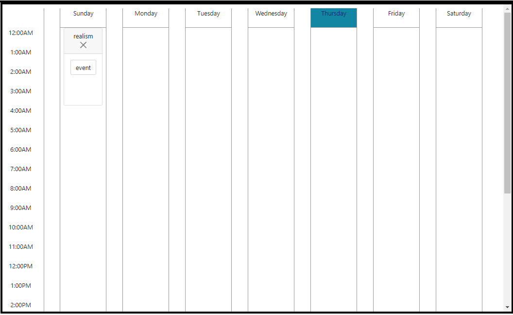
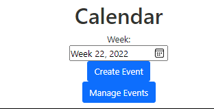

# Feature Specification

### Feature Information
|||
|---|---|
|Feature Name|Plan-At|
|Area|Calendar|
|Related Features|Bootstrap|
|Requirement Specs|
|Spec Status|Draft|

### Contact Information
|Role|Name|
|---|---|
|Manager|Chad Magendanz|
|Developer|Alex Stedman|

### Revision Summary
|Author|Date|Version|Comment|
|---|---|---|---|
|-|2/15/2022|Initial Draft|Created this page|
|Alex Stedman|4/19/2022|Rough Draft|Created base outline (main componenets)|
|Alex Stedman|5/16/2022|Rough Draft|First semi-functional calendar app with api integration|
|Alex Stedman|5/19/2022|Rough Draft|Found bugs on how dates were handled, calendar now accuratley shows dates|
|Alex Stedman|5/23/2022|Rough Draft|Implemented create-event from Jack|
|Alex Stedman|5/27/2022|Rough Draft|Added week selection and tried to fix scaling issues to no success|
|Alex Stedman|5/31/2022|Rough Draft|Tried again to do formatting and failed|
|Alex Stedman|6/2/2022|Rough Draft|Added an event manager from Jack that makes it easier to view all events|
|Alex Stedman|6/10/2022|Production|Cleaned up event manager, and added more of jack's code|

## Functional Specification
Draggable caldendar for Plan-At app 
Pulls events from a server, and can push events
per-user events
Move between weeks, an automatically go to the most recent week
view and edit all events in a separate menu

## Scenario Description
Calendar page with date highlighting for the current date.

The calendar button box, allowing a person to select a week, create a new event, and manage event

## Feature Description
Sections of the project:

1. Framework Selection:
   used vanilla js because people already knew it
2. UI:
   wanted draggable stuff for ease of use
3. Manage menu:
   not all events are in the same week, so the manage menu allows you to view all events easier
4. Current week highlighting
   help the user find the current week

